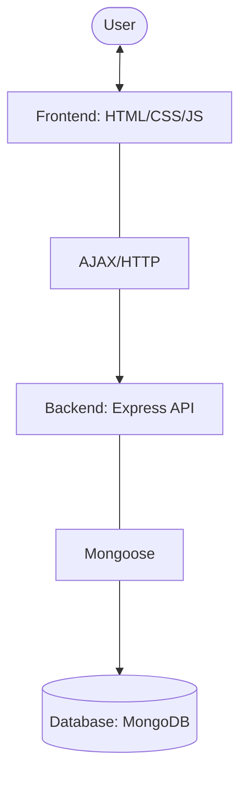

# Project Workflow

This document outlines the architecture and data flow of the **My Task Organizer** application.

## 🏗️ Technical Architecture

The application follows a standard **Client-Server** architecture:

1.  **Frontend (Client)**: A single-page application (SPA) built with HTML, CSS, and jQuery.
2.  **Backend (Server)**: A RESTful API built with Node.js and Express.
3.  **Database (Persistence)**: MongoDB Atlas (Cloud Database) using Mongoose for object modeling.

## 🔄 Core Data Flow

## 🛤️ Feature Workflows

### 1. Adding a Task
1.  **User Input**: User types a task and selects a priority in the UI.
2.  **Form Submission**: jQuery captures the submit event.
3.  **API Call (POST)**: Frontend sends a `POST /tasks` request with the task details.
4.  **Backend Processing**: Express route receives the data, creates a new `Task` model instance, and saves it to MongoDB.
5.  **Update UI**: On success, the frontend receives the new task object and adds it to the top of the list in the browser.

### 2. Rendering the List
1.  **Initial Load**: When the page opens, jQuery triggers `fetchTasks()`.
2.  **API Call (GET)**: Frontend sends a `GET /tasks` request.
3.  **Backend Retrieval**: Express finds all tasks in MongoDB, sorted by `createdAt: -1` (newest first).
4.  **Rendering**: Frontend receives the array, filters it (All/Pending/Completed), and dynamically builds the HTML list.

### 3. Completing a Task
1.  **User Interaction**: User clicks the check button.
2.  **API Call (PUT)**: Frontend sends a `PUT /tasks/:id` request with `completed: true`.
3.  **Backend Update**: MongoDB is updated.
4.  **UI Feedback**: The frontend re-renders the list, hiding the **Edit** button and applying the "completed" styling.

### 4. Editing a Task
1.  **User Interaction**: User clicks the edit (pencil) icon (only available for pending tasks).
2.  **Prompt**: A browser prompt asks for the new name.
3.  **API Call (PUT)**: Frontend sends a `PUT /tasks/:id` with the updated text.
4.  **Database Update**: The backend updates the record.
5.  **UI Refresh**: The task text is updated on the screen.

### 5. Deleting a Task
1.  **User Interaction**: User clicks the trash icon.
2.  **API Call (DELETE)**: Frontend sends a `DELETE /tasks/:id`.
3.  **Database Removal**: The backend removes the record from MongoDB.
4.  **UI Removal**: The task is removed from the local array and the list is re-rendered.
